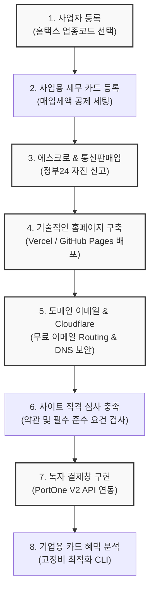

# 🇰🇷 한국 1인 창업 및 독자 결제망 구축 자동화 가이드 (Korean Bootstrap Business & PG Integration Skills)

> **이 저장소는 대한민국의 1인 창업자, 인디 해커, 소프트웨어 엔지니어들이 대행 수수료 없이 스스로 사업자 등록부터 전자상거래 통신판매업 신고, 그리고 독립 결제망(PG)을 구축하고 심사를 원패스로 통과할 수 있도록 돕는 범용 가이드이자 에이전트 전용 스킬 패키지입니다.**

본 저장소를 포크(Fork)하거나 클론(Clone)하여 설정 파일에 자신의 비즈니스 변수만 채워 넣으면, 개발 에이전트(AI Agent)가 컨텍스트를 이해하고 각 단계를 매끄럽게 가이드 및 자동 생성해 줍니다.

---

## 🗺️ 전체 로드맵 및 스킬 모듈

본 가이드는 창업 준비부터 최종 결제 승인까지의 실무 단계를 8개의 모듈형 스킬로 제공합니다.



### 1. 🏢 [사업자 등록 신청 가이드] (korean-business-registration-hometax)
* **내용**: 국세청 홈택스에서 비용 없이 개인/법인 사업자등록을 신청할 때 필요한 가이드라인입니다.
* **핵심**: 소프트웨어 개발업, 1인 미디어, 전자상거래업 등 창업 유형에 최적화된 업종코드 매핑과 사업자등록신청서 입력서식을 가이드합니다.

### 2. 💳 [사업용 신용카드 세무 최적화] (korean-business-tax-and-cards)
* **내용**: 초기 고정비(서버비, API 호출 비용 등) 지출 시 세무 처리를 효율화하기 위한 가이드입니다.
* **핵심**: 홈택스에 사업용 신용카드를 등록하고 부가가치세 매입세액 공제 및 불공제 대상 판정을 수월하게 처리합니다.

### 3. 📦 [에스크로 가입 & 통신판매업 신고] (korean-escrow-telecom-report)
* **내용**: 전자상거래 소매업 필수 요건인 구매안전서비스(에스크로) 가입과 통신판매업 정부 자진 신고 절차를 다룹니다.
* **핵심**: 은행권 에스크로 확인증 발급 요령 및 정부24를 통한 온라인 신청 프로세스를 순서대로 이행할 수 있습니다.

### 4. 🌐 [기술적인 웹사이트/홈페이지 구축 및 배포] (korean-website-deployment-guide)
* **내용**: 1인 창업자를 위한 기술적인 웹사이트/홈페이지 구축 및 호스팅 배포(Vercel, GitHub Pages, Netlify) 상세 가이드라인입니다.
* **핵심**: HTML/CSS/JS 단일 파일 템플릿부터 React, Next.js 등의 모던 스택 선택 가이드, 무료 호스팅 연동 및 커스텀 도메인 연결법.

### 5. ✉️ [Cloudflare 무료 도메인 이메일 및 DNS 설정] (korean-cloudflare-email-setup)
* **내용**: Cloudflare를 이용한 무료 도메인 이메일 수발신 구축 및 DNS(MX, SPF, DKIM, DMARC) 설정 가이드라인입니다.
* **핵심**: Cloudflare Email Routing 기반 무료 메일 수신 포워딩, Resend 연동 메일 무료 발신(보내기) 구축, 메일 스팸 분류를 방지하기 위한 보안 DNS 레코드 매핑.

### 6. ⚖️ [웹사이트 필수 법적 준수 요건 검사] (korean-website-compliance-pg)
* **내용**: PG사 심사 및 카드사 반려를 미연에 방지하기 위해 웹사이트 하단(Footer)의 의무 표기 사항을 검수합니다.
* **핵심**: 이용약관, 개인정보처리방침, 환불 규정 템플릿 제공 및 사업자번호, 통신판매번호, 에스크로 로고 등 필수 UI 레이아웃 정합성 자가진단.

### 7. 🔌 [독자 결제 사이트 구현 & PG 연동] (korean-pg-business-setup)
* **내용**: 외부 쇼핑몰 플랫폼을 빌리지 않고 내 도메인 내에서 결제가 이루어지도록 독립 결제 시스템 아키텍처를 제공합니다.
* **핵심**: PortOne V2 API 기준의 결제창 연동 스크립트, Webhook 수신 검증 로직, DB 상태 업데이트 스키마를 포함한 백엔드 연동 템플릿.

### 8. 🔍 [지출 고정비 최적화 카드 분석 CLI] (korean-card-benefits-analyzer)
* **내용**: 비즈니스 운영 시 광고비, 인프라 비용 지출에 특화된 사업자 카드를 비교 분석하는 간이 CLI 유틸리티입니다.
* **핵심**: 소스 내 간단한 데이터셋 조회를 통해 비용 절감 혜택이 가장 큰 카드를 추천해 주는 개발자용 스크립트.

---

## 🚀 활용 방법 (창업자 & 개발자 가이드)

### 1. 저장소 포크 & 클론
```bash
git clone https://github.com/your-username/korean-business-pg-skills.git
```

### 2. 개인 비즈니스 메타데이터 설정
스킬 내부에 들어있는 설정 템플릿(예: `.agents/AGENTS.md`)에 본인의 고유 정보들을 입력합니다:
* `{상호명}`: (예: 플라밍 소프트)
* `{대표자성명}`: (예: 홍길동)
* `{도메인}`: (예: my-service.com)
* `{이메일}`: (예: contact@my-service.com)

### 3. 에어전트 지시 예시
AI 에이전트에게 본 저장소를 참고하도록 프롬프트로 알려주어 가이드를 받습니다:
> *"내가 이번에 사이트를 새로 열었는데, 이 저장소의 `korean-website-compliance-pg` 가이드를 보고 내 사이트에 누락된 하단 표기 법적 고지사항이 있는지 검사해 줘."*
