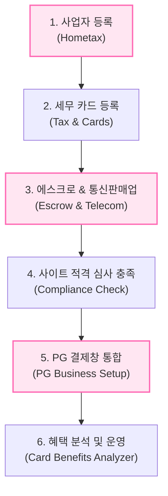

# 🦩 Korean Business & PG Integration Agent Skills

한국에서 개인/법인 사업자 등록부터 시작하여 에스크로 가입, 통신판매업 신고, 그리고 웹 서비스에 독자적인 PG(결제창) 시스템을 연동하고 적격 심사를 원패스로 통과하기 위한 에이전트 전용 스킬 패키지입니다.

---

## 🗺️ 전체 로드맵 및 모듈 안내

본 스킬 저장소는 비즈니스 셋업부터 최종 결제망 가동까지의 전체 흐름을 6개의 독립적인 하위 에이전트 스킬로 나누어 구조화했습니다.



### 1. [사업자 등록 신청 자동 가이드] (korean-business-registration-hometax)
* **목적**: 국세청 홈택스(Hometax)를 통해 대행 비용 없이 온라인으로 사업자등록을 신청하기 위한 정확한 업종코드 지정 및 단계별 입력을 자동 가이드합니다.
* **핵심 기능**: IT 서비스, 교육업, 전자상거래 소매업 등 비즈니스 유형에 맞는 최적의 주·부업종 코드 매핑 및 제출 필수 서류 체크리스트.

### 2. [사업용 카드 및 세무 최적화] (korean-business-tax-and-cards)
* **목적**: 홈택스에 사업용 신용카드를 등록하고 매입세액 공제 대상을 분류하여 초기 세무 비용을 최적화합니다.
* **핵심 기능**: 복수 카드 등록법 안내 및 AI 기반 부가가치세 매입세액 공제/불공제 판정 가이드.

### 3. [에스크로 가입 및 통신판매업 신고] (korean-escrow-telecom-report)
* **목적**: 정부24를 통한 통신판매업 신고 및 정부 면허세 납부 프로세스를 매끄럽게 처리합니다.
* **핵심 기능**: 구매안전서비스(에스크로) 이용 확인증 발급 요령 및 정부24 파일 업로드 포맷팅 가이드.

### 4. [웹사이트 필수 법적 준수 요건 검사] (korean-website-compliance-pg)
* **목적**: PG 심사(Toss Payments, NHN KCP, PortOne 등) 시 사이트 미완성 사유로 반려되는 것을 원천 차단합니다.
* **핵심 기능**: 이용약관, 개인정보처리방침, 환불 규정, 하단 법적 표기(PII/Compliance 영역) 필수 요소 추출 및 정합성 검사.

### 5. [독자 결제 사이트 구축 및 PG 연동] (korean-pg-business-setup)
* **목적**: 웹 서비스 내부에서 이탈 없이 매끄러운 결제가 이루어지도록 독자적인 결제 페이지와 백엔드 트랜잭션을 연동합니다.
* **핵심 기능**: PortOne V2 API 기반의 결제 요청, 결제 검증(Webhook), 가상계좌 입금 통보 서버리스 아키텍처 및 스키마 제공.

### 6. [카드사 혜택 분석 CLI] (korean-card-benefits-analyzer)
* **목적**: 비즈니스 운영자가 마케팅, 클라우드 서버 비용 결제 등 기업 지출 시 가장 혜택이 큰 세무 카드를 선택하도록 돕습니다.
* **핵심 기능**: CLI 기반 혜택 검색 및 업종별 최적의 신용카드 매칭 스크립트 제공.

---

## 🛠️ 에이전트(Antigravity) 활용 방법

새로운 개발 세션을 시작하거나 에이전트에게 관련 작업을 지시할 때, 본 저장소의 스킬 경로를 바인딩하여 실행할 수 있습니다.

```bash
# 1. 특정 비즈니스 셋업 단계를 물어볼 때 예시
"통신판매업 신고할 때 구매안전서비스 확인증을 어떻게 발급받는지 알려줘"
# ➔ 에스크로 가입 스킬(korean-escrow-telecom-report)이 자동 호출되어 단계별 맞춤 액션을 수행합니다.

# 2. PG 연동 전 사이트 검증을 요청할 때 예시
"현재 구현한 index.html과 footer 규격이 PG사 하단 의무 표기 사항에 맞는지 확인해줘"
# ➔ 준수 요건 검사 스킬(korean-website-compliance-pg)이 작동하여 어기거나 누락된 규격(상호명, 등록번호 등)을 감지합니다.
```
